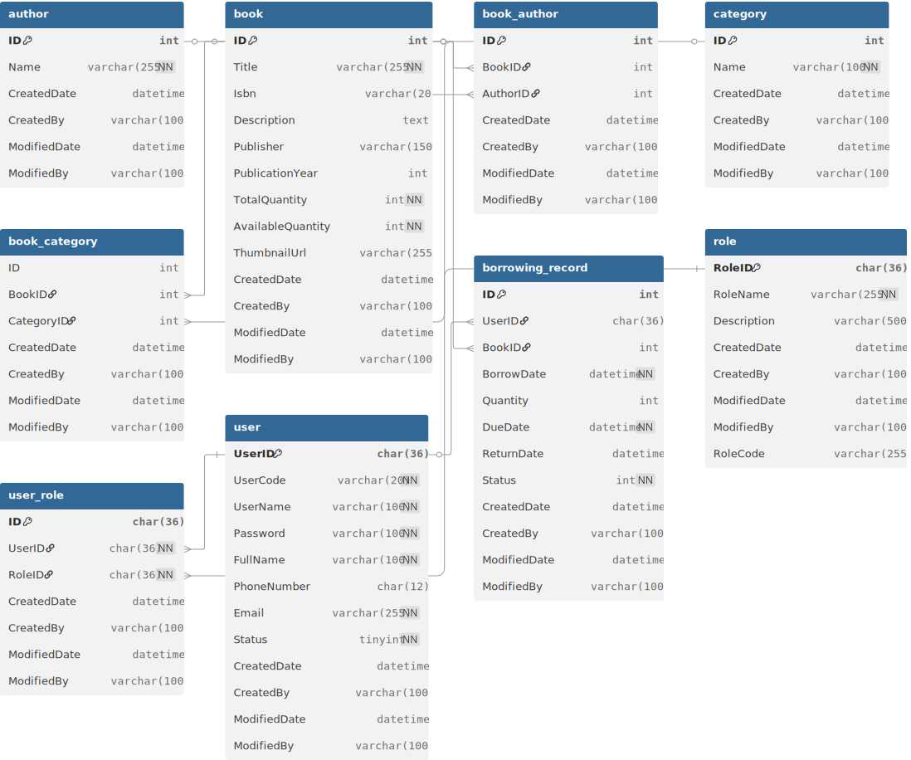

# 📚 Library Management System

Hệ thống quản lý thư viện hiện đại được xây dựng với .NET Core Web API và React.js, hỗ trợ quản lý sách, người dùng, và các hoạt động mượn/trả sách.

## Kiến trúc hệ thống

### **Tổng quan Architecture**
Hệ thống được thiết kế theo mô hình **Layered Architecture** với các thành phần:

```
┌─────────────────────────────────────────────────────────────┐
│                    PRESENTATION LAYER                        │
│  ┌─────────────────┐           ┌─────────────────────────┐   │
│  │   React.js      │           │    .NET Core Web API    │   │
│  │   Frontend      │    HTTP   │      Controllers        │   │
│  │   (Port 3000)   │ ◄────────►│     (Port 5021)         │   │
│  └─────────────────┘           └─────────────────────────┘   │
└─────────────────────────────────────────────────────────────┘
                                           │
┌─────────────────────────────────────────────────────────────┐
│                   BUSINESS LOGIC LAYER                      │
│  ┌─────────────┐  ┌─────────────┐  ┌─────────────────────┐  │
│  │   AuthBL    │  │   BookBL    │  │   BorrowRecordBL    │  │
│  │             │  │             │  │                     │  │
│  └─────────────┘  └─────────────┘  └─────────────────────┘  │
└─────────────────────────────────────────────────────────────┘
                                           │
┌─────────────────────────────────────────────────────────────┐
│                   DATA ACCESS LAYER                         │
│  ┌─────────────┐           ┌─────────────────────────────┐   │
│  │   BaseDL    │           │      DatabaseContext        │   │
│  │   (Generic) │           │     (Entity Framework)      │   │
│  └─────────────┘           └─────────────────────────────┘   │
└─────────────────────────────────────────────────────────────┘
                                           │
┌─────────────────────────────────────────────────────────────┐
│                      DATABASE LAYER                         │
│                    SQL Server Database                      │
└─────────────────────────────────────────────────────────────┘
```

### **Backend Architecture (.NET Core)**

#### **1. Project Structure**
```
LibraryManagement/
├── LibraryManagement.API/          # Web API Controllers
├── LibraryManagement.BL/           # Business Logic Layer
├── LibraryManagement.DL/           # Data Access Layer  
├── LibraryManagement.Entities/     # Domain Models & DTOs
└── LibraryManagement.Common/       # Shared Utilities

BaseCoreService/                    # Shared Core Services
├── BaseCoreService.API/            # Base API Controllers
├── BaseCoreService.BL/             # Base Business Logic
├── BaseCoreService.DL/             # Base Data Access
├── BaseCoreService.Entities/       # Base Entities
├── BaseCoreService.Authen/         # Authentication Module
└── BaseCoreService.Common/         # Common Utilities
```

#### **2. Design Patterns**
- **Repository Pattern**: Data access abstraction
- **Dependency Injection**: Loose coupling between layers
- **Generic Base Classes**: Code reusability
- **DTO Pattern**: Data transfer objects
- **Service Layer Pattern**: Business logic encapsulation

### **Frontend Architecture (React.js)**

#### **1. Component Structure**
```
src/
├── components/                     # Reusable Components
│   ├── Layout/                    # Header, Sidebar, Layout
│   ├── Books/                     # Book Management
│   ├── BorrowReturn/              # Borrow/Return Features
│   └── Dashboard/                 # Dashboard Components
├── pages/                         # Page Components (JSX)
│   ├── Login.jsx                  # Authentication Page
│   ├── BookList.jsx               # Book Listing
│   └── AdminBooks.jsx             # Admin Book Management
├── services/                      # API Services
├── utils/                         # Utility Functions
└── styles/                        # CSS Styles
```

#### **2. State Management**
- **React Hooks**: useState, useEffect, useCallback
- **Local Storage**: Data persistence
- **Context API**: User authentication state

## Sơ đồ cơ sở dữ liệu

### **Entity Relationship Diagram**




### **Authentication Flow**
```
[User Login] → [Validate Credentials] → [Generate JWT Token] → [Store in LocalStorage] → [Access Protected Routes]
```

## Hướng dẫn chạy chương trình

### **Yêu cầu hệ thống**
- **.NET Core 8.0** hoặc mới hơn
- **Node.js 16+** và **npm**
- **SQL Server** (LocalDB hoặc Express)
- **Visual Studio 2022** hoặc **VS Code**

### **1. Setup Backend (.NET Core API)**

#### **Bước 1: Clone repository**
```bash
git clone https://github.com/longhoangk67hus/Library-Management.git
cd Library-Management
```

#### **Bước 2: Restore packages**
```bash
cd LibraryManagement/LibraryManagement.API
dotnet restore
```

#### **Bước 3: Update Database Connection**
Chỉnh sửa `appsettings.json`:
```json
{
  "ConnectionStrings": {
    "DefaultConnection": "Server=(localdb)\\mssqllocaldb;Database=LibraryManagementDB;Trusted_Connection=true;"
  },
  "Jwt": {
    "Key": "your-secret-key-here",
    "Issuer": "LibraryManagement",
    "Audience": "LibraryManagementUsers",
    "Expired": "24"
  }
}
```

#### **Bước 4: Run Database Migrations**
```bash
dotnet ef database update
```

#### **Bước 5: Start Backend Server**
```bash
dotnet run
```
Backend sẽ chạy tại: `https://localhost:5021`

### **2. Setup Frontend (React.js)**

#### **Bước 1: Navigate to Client folder**
```bash
cd "LibraryManagement - Client"
```

#### **Bước 2: Install dependencies**
```bash
npm install
```

#### **Bước 3: Start Development Server**
```bash
npm start
```
Frontend sẽ chạy tại: `http://localhost:3000`

### **3. Demo Accounts**

| Username | Password | Role | Access Level |
|----------|----------|------|-------------|
| `admin` | `123456` | Admin | Full access |
| `long` | `123456` | User | Limited access |

### **4. API Documentation**

#### **Authentication Endpoints**
```
POST /api/v1/Authens/login
POST /api/v1/Authens/user/register
```

#### **Books Endpoints**
```
GET    /api/v1/Books              # Get all books
GET    /api/v1/Books/{id}         # Get book by ID
POST   /api/v1/Books              # Create new book (Admin)
PUT    /api/v1/Books/{id}         # Update book (Admin)
DELETE /api/v1/Books/{id}         # Delete book (Admin)
```

#### **Borrow Records Endpoints**
```
GET    /api/v1/BorrowRecords      # Get borrow records
POST   /api/v1/BorrowRecords      # Borrow a book
PUT    /api/v1/BorrowRecords/{id} # Return a book
```

## Tính năng chính

### **✅ Đã hoàn thành**
- [x] Hệ thống đăng nhập/đăng ký
- [x] Phân quyền Admin/User
- [x] Quản lý sách (CRUD)
- [x] Mượn/trả sách
- [x] Dashboard thống kê
- [x] Responsive design
- [x] Data persistence (localStorage)


## Technologies Stack

### **Backend**
- **.NET Core 8.0** - Web API Framework
- **Entity Framework Core** - ORM
- **SQL Server** - Database
- **JWT Authentication** - Security
- **Swagger** - API Documentation

### **Frontend**
- **React.js 18** - UI Framework
- **JavaScript (ES6+)** - Programming Language
- **CSS3** - Styling
- **LocalStorage** - Client-side Storage
- **Responsive Design** - Mobile-friendly

### **Development Tools**
- **Visual Studio 2022** - IDE
- **VS Code** - Code Editor
- **Postman** - API Testing
- **Git** - Version Control

## Contributors

- **Hoàng Ngọc Long**
- **Email**: hoangngoclong.dev@gmail.com
- **GitHub**: [@longhoangk67hus](https://github.com/longhoangk67hus)

---
